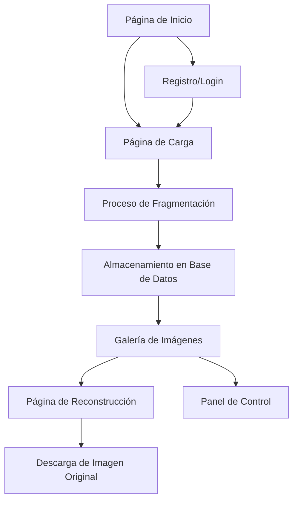

# Documento de Requisitos del Producto - Sistema de Fragmentación y Reconstrucción de Imágenes

## 1. Descripción General del Producto

El Sistema de Fragmentación y Reconstrucción de Imágenes es una solución innovadora diseñada para optimizar el almacenamiento y manejo de imágenes digitales mediante la fragmentación inteligente en partes de 64KB, compresión individual y almacenamiento distribuido. Esta tecnología permite una gestión más eficiente del espacio de almacenamiento y mejora la seguridad de los datos al dividir la información en múltiples fragmentos.

El sistema está dirigido a usuarios que necesitan almacenar y gestionar grandes volúmenes de imágenes de manera eficiente, incluyendo fotógrafos, diseñadores, empresas de medios y cualquier organización que requiera optimización de almacenamiento de imágenes. El producto resuelve problemas de espacio de almacenamiento, mejora la velocidad de carga/descarga y proporciona una capa adicional de seguridad mediante la fragmentación de datos.

## 2. Características Principales

### 2.1 Roles de Usuario

| Rol | Método de Registro | Permisos Principales |
|-----|-------------------|---------------------|
| Usuario Estándar | Registro por email | Subir, ver y descargar imágenes propias |
| Usuario Premium | Actualización desde estándar | Límite aumentado de almacenamiento, acceso a historial completo |
| Administrador | Designado por el sistema | Gestión de usuarios, monitoreo del sistema, acceso a todas las imágenes |

### 2.2 Módulos de Funcionalidad

El sistema de fragmentación de imágenes consta de las siguientes páginas principales:

1. **Página de Inicio**: Presentación del servicio, estadísticas de uso, acceso rápido a funciones principales
2. **Página de Carga**: Interfaz para subir imágenes JPG y PNG, configuración de compresión
3. **Galería de Imágenes**: Visualización de imágenes almacenadas con opciones de gestión
4. **Página de Reconstrucción**: Herramienta para ensamblar y descargar imágenes fragmentadas
5. **Panel de Control**: Estadísticas de uso, gestión de almacenamiento, configuración de usuario

### 2.3 Detalles de Páginas

| Nombre de Página | Módulo | Descripción de Características |
|------------------|---------|-------------------------------|
| Página de Inicio | Sección Hero | Presentación visual del sistema con animaciones de fragmentación |
| Página de Inicio | Barra de Navegación | Menú principal con acceso a todas las funciones del sistema |
| Página de Inicio | Estadísticas en Vivo | Mostrar número de imágenes procesadas, espacio ahorrado, usuarios activos |
| Página de Carga | Área de Arrastre | Zona para arrastrar y soltar múltiples imágenes JPG/PNG simultáneamente |
| Página de Carga | Selector de Archivos | Botón tradicional para seleccionar imágenes desde el explorador |
| Página de Carga | Configuración de Compresión | Control deslizante para ajustar nivel de compresión (1-9) |
| Página de Carga | Barra de Progreso | Visualización en tiempo real del proceso de fragmentación y compresión |
| Página de Carga | Vista Previa | Miniatura de imagen con tamaño original vs tamaño fragmentado |
| Galería de Imágenes | Cuadrícula de Imágenes | Visualización en mosaico de imágenes con miniaturas |
| Galería de Imágenes | Filtros y Búsqueda | Búsqueda por nombre, fecha, tamaño, filtro por tipo de imagen |
| Galería de Imágenes | Acciones por Imagen | Botones para descargar, eliminar, ver detalles, reconstruir |
| Galería de Imágenes | Información de Fragmentación | Mostrar número de fragmentos, porcentaje de compresión logrado |
| Página de Reconstrucción | Selector de Imagen | Lista desplegable para elegir imagen a reconstruir |
| Página de Reconstrucción | Proceso de Ensamblaje | Animación visual del proceso de reconstrucción de fragmentos |
| Página de Reconstrucción | Descarga Resultado | Botón para descargar imagen reconstruida en resolución original |
| Panel de Control | Estadísticas de Uso | Gráficos de espacio utilizado, imágenes procesadas, tendencias |
| Panel de Control | Gestión de Almacenamiento | Visualización de espacio disponible, opciones de optimización |
| Panel de Control | Configuración de Usuario | Preferencias de compresión, notificaciones, límite de carga |

## 3. Flujo de Proceso Principal

### Flujo de Usuario Estándar
1. El usuario accede al sistema y se registra con su email
2. Navega a la página de carga de imágenes
3. Selecciona o arrastra imágenes JPG/PNG para procesar
4. Configura el nivel de compresión deseado
5. El sistema fragmenta automáticamente en partes de 64KB
6. Cada fragmento se comprime individualmente
7. Los fragmentos y metadatos se almacenan en la base de datos
8. El usuario puede ver sus imágenes en la galería
9. Al necesitar la imagen, accede a la reconstrucción
10. El sistema ensambla los fragmentos y permite la descarga

### Flujo de Usuario Premium
- Incluye todas las características del usuario estándar
- Mayor límite de almacenamiento (10GB vs 1GB)
- Acceso a historial completo de operaciones
- Prioridad en el procesamiento de imágenes

## 4. Diseño de Interfaz de Usuario

### 4.1 Estilo de Diseño

- **Colores Primarios**: Azul tecnológico (#2563EB) con gradientes modernos
- **Colores Secundarios**: Gris neutro (#6B7280) y blanco puro (#FFFFFF)
- **Estilo de Botones**: Bordes redondeados con sombras sutiles, efectos hover suaves
- **Tipografía**: Inter para títulos, Roboto para contenido, tamaños base 16px
- **Estilo de Layout**: Diseño de tarjetas con espaciado generoso, navegación superior fija
- **Iconos**: Estilo outline minimalista, consistente en todo el sistema

### 4.2 Descripción General de Diseño de Páginas

| Nombre de Página | Módulo | Elementos de UI |
|------------------|---------|------------------|
| Página de Inicio | Sección Hero | Imagen de fondo con overlay oscuro, texto superpuesto con animación de tipowriter, botón CTA prominente |
| Página de Inicio | Estadísticas | Tarjetas con números animados, iconos de FontAwesome, colores de acento dinámicos |
| Página de Carga | Área de Arrastre | Zona punteada con icono de nube, cambia de color al arrastrar, mensajes de estado dinámicos |
| Página de Carga | Barra de Progreso | Progress bar animada con porcentaje, cambia de color según estado (azul=procesando, verde=completado) |
| Galería de Imágenes | Cuadrícula | Layout masonry adaptativo, lazy loading de imágenes, efecto hover con información adicional |
| Galería de Imágenes | Acciones | Botones con iconos, tooltip informativo, confirmación antes de eliminar |
| Página de Reconstrucción | Proceso Visual | Animación de puzzle ensamblando, barra de progreso circular, preview en tiempo real |
| Panel de Control | Gráficos | Charts.js para visualizaciones, colores consistentes con paleta principal, datos en tiempo real |

### 4.3 Responsividad

- **Primario para Escritorio**: Diseño optimizado para pantallas de 1200px+
- **Adaptación Móvil**: Breakpoints en 768px y 480px, menú hamburguesa para móvil
- **Optimización Táctil**: Botones de tamaño mínimo 44px, gestos de swipe en galería
- **Carga Progresiva**: Imágenes adaptativas según resolución de pantalla

## 5. Beneficios del Sistema

### 5.1 Optimización de Almacenamiento
- Reducción promedio del 30-50% en el tamaño total de almacenamiento
- Fragmentación inteligente permite mejor distribución en servidores
- Compresión individual de fragmentos maximiza la eficiencia

### 5.2 Seguridad Mejorada
- Imágenes divididas en múltiples fragmentos aumentan la seguridad
- Sin archivo completo almacenado, reducir riesgo de acceso no autorizado
- Metadatos separados permiten auditoría y trazabilidad

### 5.3 Rendimiento Superior
- Carga y descarga paralela de fragmentos
- Mejor aprovechamiento del ancho de banda
- Reconstrucción optimizada con algoritmos eficientes

### 5.4 Escalabilidad
- Arquitectura distribuida permite crecimiento horizontal
- Sin límite teórico en el tamaño de imagen a procesar
- Facilita implementación de CDN para fragmentos

## 6. Requisitos Funcionales

### 6.1 Requisitos de Procesamiento
- RF1: El sistema debe aceptar imágenes JPG y PNG de hasta 50MB
- RF2: Fragmentación automática en partes exactas de 64KB (+/- 1KB)
- RF3: Compresión configurable (niveles 1-9) para cada fragmento
- RF4: Almacenamiento de fragmentos con metadatos (nombre original, tamaño, fecha, checksum)
- RF5: Reconstrucción exacta de la imagen original sin pérdida de calidad
- RF6: Verificación de integridad mediante checksum MD5

### 6.2 Requisitos de Interfaz
- RF7: Interfaz web responsive compatible con Chrome, Firefox, Safari, Edge
- RF8: Soporte para carga por arrastre y selección tradicional
- RF9: Visualización de progreso en tiempo real durante procesamiento
- RF10: Preview de imagen antes y después de procesamiento
- RF11: Gestión de múltiples imágenes simultáneamente (hasta 10)

### 6.3 Requisitos de Seguridad
- RF12: Autenticación de usuarios mediante email y contraseña
- RF13: Autorización basada en roles (usuario estándar, premium, admin)
- RF14: Encriptación de fragmentos en reposo (AES-256)
- RF15: HTTPS obligatorio para todas las comunicaciones
- RF16: Límite de intentos de login (5 intentos cada 15 minutos)

## 7. Requisitos No Funcionales

### 7.1 Rendimiento
- RNF1: Tiempo de procesamiento < 30 segundos para imágenes de 10MB
- RNF2: Soporte concurrente para 100 usuarios simultáneos
- RNF3: Tiempo de reconstrucción < 20 segundos para imágenes estándar
- RNF4: Disponibilidad del sistema 99.5% (mantenimiento planificado excluido)

### 7.2 Escalabilidad
- RNF5: Arquitectura horizontalmente escalable
- RNF6: Capacidad de almacenamiento inicial de 1TB, expandible
- RNF7: Soporte para crecimiento de usuarios de 1,000 a 100,000

### 7.3 Mantenibilidad
- RNF8: Código documentado siguiendo estándares JSDoc
- RNF9: Logs detallados de operaciones y errores
- RNF10: Monitoreo de salud del sistema en tiempo real
- RNF11: Actualizaciones sin downtime (blue-green deployment)

### 7.4 Usabilidad
- RNF12: Tiempo de aprendizaje < 5 minutos para funciones básicas
- RNF13: Interfaz intuitiva con íconos y tooltips descriptivos
- RNF14: Tiempo de respuesta de interfaz < 2 segundos
- RNF15: Accesibilidad WCAG 2.1 nivel AA

## 8. Casos de Uso Principales

### 8.1 Caso de Uso: Carga y Fragmentación de Imagen
**Actor**: Usuario estándar o premium
**Precondición**: Usuario autenticado con espacio disponible
**Flujo Principal**:
1. Usuario accede a página de carga
2. Selecciona imagen JPG o PNG desde su dispositivo
3. Sistema valida formato y tamaño de imagen
4. Usuario configura nivel de compresión deseado
5. Sistema procesa y fragmenta la imagen
6. Sistema muestra confirmación y preview
7. Imagen aparece en galería del usuario

### 8.2 Caso de Uso: Reconstrucción y Descarga
**Actor**: Usuario con imágenes almacenadas
**Precondición**: Imagen previamente fragmentada y almacenada
**Flujo Principal**:
1. Usuario accede a galería de imágenes
2. Selecciona imagen a reconstruir
3. Sistema recupera todos los fragmentos
4. Verifica integridad mediante checksums
5. Reconstruye imagen original
6. Presenta preview de imagen reconstruida
7. Usuario descarga imagen en resolución original

### 8.3 Caso de Uso: Gestión de Almacenamiento
**Actor**: Usuario premium o administrador
**Precondición**: Usuario con acceso a panel de control
**Flujo Principal**:
1. Usuario accede a panel de control
2. Visualiza estadísticas de uso y espacio disponible
3. Identifica imágenes grandes o antiguas
4. Selecciona imágenes para optimización o eliminación
5. Sistema ejecuta acciones de optimización
6. Actualiza métricas de almacenamiento

### 8.4 Caso de Uso: Monitoreo Administrativo
**Actor**: Administrador del sistema
**Precondición**: Rol de administrador asignado
**Flujo Principal**:
1. Admin accede a panel administrativo
2. Visualiza métricas del sistema en tiempo real
3. Monitorea salud de servidores y base de datos
4. Gestiona cuentas de usuario (crear, modificar, suspender)
5. Ejecuta tareas de mantenimiento programado
6. Genera reportes de uso y rendimiento

## 9. Consideraciones Adicionales

### 9.1 Seguridad y Privacidad
- Cumplimiento con GDPR y regulaciones de privacidad de datos
- Opción de eliminación permanente de imágenes y fragmentos
- Auditoría de acceso a imágenes sensibles
- Backup automático de fragmentos críticos

### 9.2 Integraciones Futuras
- API REST para integración con aplicaciones terceras
- Plugin para CMS populares (WordPress, Drupal)
- Integración con servicios de almacenamiento en la nube
- Compatibilidad con formatos adicionales (WEBP, HEIC)

### 9.3 Modelo de Negocio
- **Freemium**: 1GB gratis para usuarios estándar
- **Premium**: $9.99/mes por 10GB con características adicionales
- **Enterprise**: Precio personalizado para volúmenes grandes
- **API**: Modelo por uso para integraciones