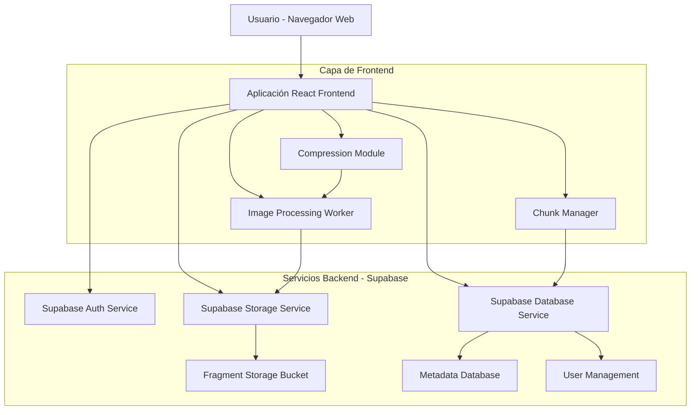
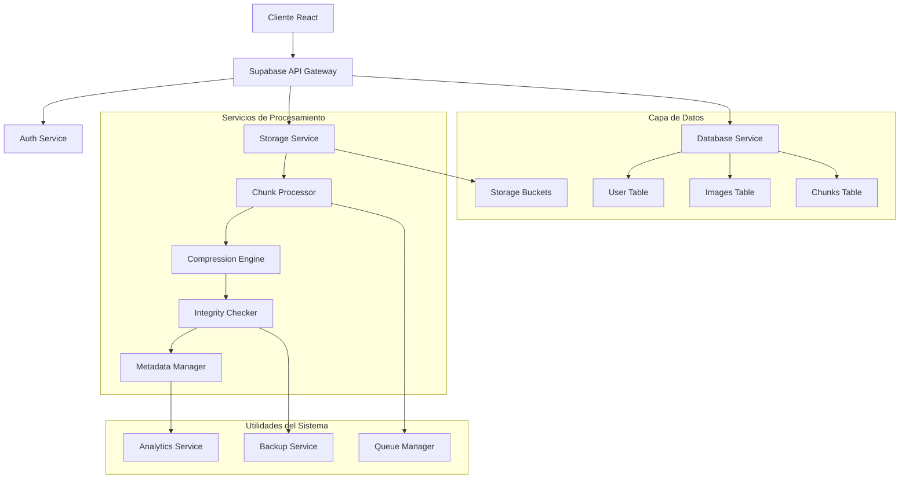

# Documento de Arquitectura Técnica - Sistema de Fragmentación y Reconstrucción de Imágenes

## 1. Diseño de Arquitectura



## 2. Descripción de Tecnologías

### Stack Tecnológico Principal

* **Frontend**: React\@18 + Vite + Tailwind CSS\@3

* **Backend**: Supabase (BaaS - Backend as a Service)

* **Base de Datos**: PostgreSQL (integrado en Supabase)

* **Almacenamiento**: Supabase Storage

* **Autenticación**: Supabase Auth

* **Procesamiento de Imágenes**: Canvas API + Web Workers

### Librerías y Dependencias Esenciales

* **react-dropzone**: Para carga de archivos por arrastre

* **compressorjs**: Compresión de imágenes del lado del cliente

* **crypto-js**: Generación de checksums para integridad

* **react-query**: Gestión de estado del servidor y caché

* **chart.js**: Visualización de estadísticas

* **react-router-dom**: Navegación de la aplicación

## 3. Definición de Rutas

| Ruta         | Propósito                                               |
| ------------ | ------------------------------------------------------- |
| /            | Página de inicio con presentación del servicio          |
| /login       | Página de autenticación de usuarios                     |
| /register    | Formulario de registro de nuevos usuarios               |
| /upload      | Interfaz principal para cargar y fragmentar imágenes    |
| /gallery     | Galería de imágenes del usuario con opciones de gestión |
| /reconstruct | Herramienta para reconstruir imágenes desde fragmentos  |
| /dashboard   | Panel de control con estadísticas y configuración       |
| /profile     | Página de perfil y configuración de usuario             |

## 4. Definiciones de API

### 4.1 API de Autenticación (Supabase Auth)

```typescript
// Login de usuario
POST /auth/v1/token?grant_type=password

Request Body:
{
  "email": string,
  "password": string
}

Response:
{
  "access_token": string,
  "refresh_token": string,
  "user": {
    "id": string,
    "email": string,
    "role": "standard" | "premium" | "admin"
  }
}

// Registro de usuario
POST /auth/v1/signup

Request Body:
{
  "email": string,
  "password": string,
  "data": {
    "plan": "free" | "premium",
    "storage_used": number,
    "max_storage": number
  }
}
```

### 4.2 API de Gestión de Imágenes

```typescript
// Subir y fragmentar imagen
POST /storage/v1/object/images/{user_id}/{image_id}

Request Headers:
{
  "Authorization": "Bearer {access_token}",
  "Content-Type": "multipart/form-data"
}

Request Body:
{
  "file": File,
  "compression_level": number (1-9),
  "chunk_size": number (default: 65536)
}

Response:
{
  "image_id": string,
  "original_name": string,
  "original_size": number,
  "compressed_size": number,
  "chunk_count": number,
  "checksum": string,
  "created_at": string
}

// Obtener lista de imágenes
GET /rest/v1/images?user_id=eq.{user_id}

Response:
{
  "data": [{
    "id": string,
    "user_id": string,
    "original_name": string,
    "original_size": number,
    "compressed_size": number,
    "chunk_count": number,
    "checksum": string,
    "created_at": string,
    "last_accessed": string
  }]
}

// Reconstruir imagen
GET /storage/v1/object/images/{user_id}/{image_id}/reconstruct

Response:
{
  "download_url": string,
  "reconstruction_time": number,
  "integrity_check": boolean
}
```

### 4.3 Tipos de Datos TypeScript

```typescript
// Tipo de usuario
interface User {
  id: string;
  email: string;
  role: 'standard' | 'premium' | 'admin';
  plan: 'free' | 'premium';
  storage_used: number;
  max_storage: number;
  created_at: string;
  updated_at: string;
}

// Tipo de imagen
interface Image {
  id: string;
  user_id: string;
  original_name: string;
  original_size: number;
  compressed_size: number;
  compression_level: number;
  chunk_count: number;
  checksum: string;
  mime_type: 'image/jpeg' | 'image/png';
  metadata: {
    width: number;
    height: number;
    color_space: string;
    has_alpha: boolean;
  };
  created_at: string;
  last_accessed: string;
}

// Tipo de fragmento
interface ImageChunk {
  id: string;
  image_id: string;
  chunk_index: number;
  chunk_data: Blob;
  chunk_size: number;
  compressed_size: number;
  checksum: string;
  storage_path: string;
}

// Estado de procesamiento
interface ProcessingStatus {
  image_id: string;
  status: 'uploading' | 'fragmenting' | 'compressing' | 'storing' | 'completed' | 'error';
  progress: number;
  current_chunk: number;
  total_chunks: number;
  error_message?: string;
}
```

## 5. Diagrama de Arquitectura del Servidor



## 6. Modelo de Datos

### 6.1 Definición del Modelo de Datos

```mermaid
erDiagram
    USERS ||--o{ IMAGES : owns
    IMAGES ||--o{ CHUNKS : contains
    USERS ||--o{ USER_SESSIONS : has
    IMAGES ||--o{ PROCESSING_LOGS : generates

    USERS {
        uuid id PK
        string email UK
        string password_hash
        string role
        string plan
        bigint storage_used
        bigint max_storage
        timestamp created_at
        timestamp updated_at
    }

    IMAGES {
        uuid id PK
        uuid user_id FK
        string original_name
        bigint original_size
        bigint compressed_size
        integer compression_level
        integer chunk_count
        string checksum
        string mime_type
        json metadata
        timestamp created_at
        timestamp last_accessed
        boolean is_deleted
    }

    CHUNKS {
        uuid id PK
        uuid image_id FK
        integer chunk_index
        string storage_path
        bigint chunk_size
        bigint compressed_size
        string checksum
        timestamp created_at
    }

    USER_SESSIONS {
        uuid id PK
        uuid user_id FK
        string access_token
        string refresh_token
        timestamp expires_at
        string ip_address
        timestamp created_at
    }

    PROCESSING_LOGS {
        uuid id PK
        uuid image_id FK
        uuid user_id FK
        string operation_type
        string status
        json operation_details
        string error_message
        timestamp created_at
    }
}
```

### 6.2 Lenguaje de Definición de Datos (DDL)

```sql
-- Tabla de usuarios
CREATE TABLE users (
    id UUID PRIMARY KEY DEFAULT gen_random_uuid(),
    email VARCHAR(255) UNIQUE NOT NULL,
    password_hash VARCHAR(255) NOT NULL,
    role VARCHAR(20) DEFAULT 'standard' CHECK (role IN ('standard', 'premium', 'admin')),
    plan VARCHAR(20) DEFAULT 'free' CHECK (plan IN ('free', 'premium')),
    storage_used BIGINT DEFAULT 0,
    max_storage BIGINT DEFAULT 1073741824, -- 1GB en bytes
    created_at TIMESTAMP WITH TIME ZONE DEFAULT NOW(),
    updated_at TIMESTAMP WITH TIME ZONE DEFAULT NOW()
);

-- Índices para usuarios
CREATE INDEX idx_users_email ON users(email);
CREATE INDEX idx_users_role ON users(role);
CREATE INDEX idx_users_plan ON users(plan);

-- Tabla de imágenes
CREATE TABLE images (
    id UUID PRIMARY KEY DEFAULT gen_random_uuid(),
    user_id UUID NOT NULL REFERENCES users(id) ON DELETE CASCADE,
    original_name VARCHAR(255) NOT NULL,
    original_size BIGINT NOT NULL,
    compressed_size BIGINT NOT NULL,
    compression_level INTEGER CHECK (compression_level >= 1 AND compression_level <= 9),
    chunk_count INTEGER NOT NULL,
    checksum VARCHAR(32) NOT NULL,
    mime_type VARCHAR(20) CHECK (mime_type IN ('image/jpeg', 'image/png')),
    metadata JSONB,
    created_at TIMESTAMP WITH TIME ZONE DEFAULT NOW(),
    last_accessed TIMESTAMP WITH TIME ZONE DEFAULT NOW(),
    is_deleted BOOLEAN DEFAULT FALSE
);

-- Índices para imágenes
CREATE INDEX idx_images_user_id ON images(user_id);
CREATE INDEX idx_images_created_at ON images(created_at DESC);
CREATE INDEX idx_images_checksum ON images(checksum);
CREATE INDEX idx_images_is_deleted ON images(is_deleted);

-- Tabla de fragmentos
CREATE TABLE chunks (
    id UUID PRIMARY KEY DEFAULT gen_random_uuid(),
    image_id UUID NOT NULL REFERENCES images(id) ON DELETE CASCADE,
    chunk_index INTEGER NOT NULL,
    storage_path VARCHAR(500) NOT NULL,
    chunk_size BIGINT NOT NULL,
    compressed_size BIGINT NOT NULL,
    checksum VARCHAR(32) NOT NULL,
    created_at TIMESTAMP WITH TIME ZONE DEFAULT NOW(),
    UNIQUE(image_id, chunk_index)
);

-- Índices para fragmentos
CREATE INDEX idx_chunks_image_id ON chunks(image_id);
CREATE INDEX idx_chunks_storage_path ON chunks(storage_path);

-- Tabla de sesiones
CREATE TABLE user_sessions (
    id UUID PRIMARY KEY DEFAULT gen_random_uuid(),
    user_id UUID NOT NULL REFERENCES users(id) ON DELETE CASCADE,
    access_token VARCHAR(500) NOT NULL,
    refresh_token VARCHAR(500) NOT NULL,
    expires_at TIMESTAMP WITH TIME ZONE NOT NULL,
    ip_address INET,
    created_at TIMESTAMP WITH TIME ZONE DEFAULT NOW()
);

-- Índices para sesiones
CREATE INDEX idx_sessions_user_id ON user_sessions(user_id);
CREATE INDEX idx_sessions_access_token ON user_sessions(access_token);
CREATE INDEX idx_sessions_expires_at ON user_sessions(expires_at);

-- Tabla de logs de procesamiento
CREATE TABLE processing_logs (
    id UUID PRIMARY KEY DEFAULT gen_random_uuid(),
    image_id UUID NOT NULL REFERENCES images(id) ON DELETE CASCADE,
    user_id UUID NOT NULL REFERENCES users(id) ON DELETE CASCADE,
    operation_type VARCHAR(50) NOT NULL,
    status VARCHAR(20) CHECK (status IN ('started', 'processing', 'completed', 'failed')),
    operation_details JSONB,
    error_message TEXT,
    created_at TIMESTAMP WITH TIME ZONE DEFAULT NOW()
);

-- Índices para logs
CREATE INDEX idx_logs_image_id ON processing_logs(image_id);
CREATE INDEX idx_logs_user_id ON processing_logs(user_id);
CREATE INDEX idx_logs_created_at ON processing_logs(created_at DESC);
CREATE INDEX idx_logs_status ON processing_logs(status);

-- Permisos de Supabase
GRANT SELECT ON users TO anon;
GRANT ALL PRIVILEGES ON users TO authenticated;
GRANT SELECT ON images TO anon;
GRANT ALL PRIVILEGES ON images TO authenticated;
GRANT SELECT ON chunks TO anon;
GRANT ALL PRIVILEGES ON chunks TO authenticated;
GRANT SELECT ON processing_logs TO anon;
GRANT ALL PRIVILEGES ON processing_logs TO authenticated;

-- Datos iniciales de prueba
INSERT INTO users (email, password_hash, role, plan, storage_used, max_storage) VALUES
('admin@system.com', '$2b$10$rQJ8jX0K8J8jX0K8J8jX0O8J8jX0K8J8jX0K8J8jX0O8J8jX0K8J8jX0K', 'admin', 'premium', 0, 10737418240),
('demo@user.com', '$2b$10$rQJ8jX0K8J8jX0K8J8jX0O8J8jX0K8J8jX0K8J8jX0O8J8jX0K8J8jX0K', 'standard', 'free', 0, 1073741824);
```

## 7. Proceso de Fragmentación y Reconstrucción

### 7.1 Algoritmo de Fragmentación

```typescript
class ImageFragmenter {
  private readonly CHUNK_SIZE = 64 * 1024; // 64KB
  
  async fragmentImage(file: File, compressionLevel: number): Promise<{
    chunks: Blob[],
    metadata: ImageMetadata,
    checksum: string
  }> {
    // Leer archivo como ArrayBuffer
    const arrayBuffer = await file.arrayBuffer();
    const uint8Array = new Uint8Array(arrayBuffer);
    
    // Calcular checksum MD5 de la imagen completa
    const checksum = CryptoJS.MD5(CryptoJS.lib.WordArray.create(uint8Array)).toString();
    
    // Dividir en fragmentos
    const chunks: Blob[] = [];
    const totalSize = uint8Array.length;
    let offset = 0;
    
    while (offset < totalSize) {
      const end = Math.min(offset + this.CHUNK_SIZE, totalSize);
      const chunkData = uint8Array.slice(offset, end);
      
      // Comprimir fragmento individual
      const compressedChunk = await this.compressChunk(chunkData, compressionLevel);
      chunks.push(new Blob([compressedChunk]));
      
      offset = end;
    }
    
    // Obtener metadatos de la imagen
    const metadata = await this.extractImageMetadata(file);
    
    return {
      chunks,
      metadata,
      checksum
    };
  }
  
  private async compressChunk(data: Uint8Array, level: number): Promise<Uint8Array> {
    // Usar pako.js para compresión DEFLATE
    const compressed = pako.deflate(data, { level });
    return compressed;
  }
  
  private async extractImageMetadata(file: File): Promise<ImageMetadata> {
    return new Promise((resolve, reject) => {
      const img = new Image();
      img.onload = () => {
        resolve({
          width: img.width,
          height: img.height,
          mimeType: file.type,
          size: file.size
        });
      };
      img.onerror = reject;
      img.src = URL.createObjectURL(file);
    });
  }
}
```

### 7.2 Algoritmo de Reconstrucción

```typescript
class ImageReconstructor {
  async reconstructImage(chunks: Blob[], metadata: ImageMetadata): Promise<Blob> {
    const decompressedChunks: Uint8Array[] = [];
    
    // Descomprimir cada fragmento
    for (const chunk of chunks) {
      const arrayBuffer = await chunk.arrayBuffer();
      const decompressed = pako.inflate(new Uint8Array(arrayBuffer));
      decompressedChunks.push(decompressed);
    }
    
    // Ensamblar fragmentos
    const totalSize = decompressedChunks.reduce((sum, chunk) => sum + chunk.length, 0);
    const reconstructed = new Uint8Array(totalSize);
    
    let offset = 0;
    for (const chunk of decompressedChunks) {
      reconstructed.set(chunk, offset);
      offset += chunk.length;
    }
    
    // Verificar integridad
    const checksum = CryptoJS.MD5(CryptoJS.lib.WordArray.create(reconstructed)).toString();
    
    // Crear Blob final
    return new Blob([reconstructed], { type: metadata.mimeType });
  }
}
```

## 8. Consideraciones de Seguridad

### 8.1 Encriptación de Datos

* **En tránsito**: Todas las comunicaciones usan HTTPS/TLS 1.3

* **En reposo**: Fragmentos sensibles se encriptan con AES-256

* **Gestión de claves**: Uso de Supabase Vault para gestión segura

### 8.2 Control de Acceso

* **RBAC (Role-Based Access Control)**: Diferentes niveles de acceso por rol

* **Políticas de Supabase RLS**: Row Level Security para datos de usuario

* **Rate Limiting**: Límite de 100 peticiones por minuto por usuario

### 8.3 Auditoría y Monitoreo

* **Logs de acceso**: Registro de todas las operaciones críticas

* **Monitoreo en tiempo real**: Alertas para actividades sospechosas

* **Backup automático**: Respaldos diarios de base de datos y fragmentos

## 9. Optimización de Rendimiento

### 9.1 Estrategias de Caché

* **Browser caching**: Cache de imágenes y assets estáticos

* **React Query caching**: Cache inteligente de datos del servidor

* **CDN integration**: Distribución geográfica de fragmentos populares

### 9.2 Procesamiento Asíncrono

* **Web Workers**: Procesamiento de imágenes en background

* **Queue system**: Cola de procesamiento para operaciones pesadas

* **Progressive loading**: Carga progresiva de imágenes en galería

### 9.3 Optimización de Almacenamiento

* **Deduplicación**: Evitar almacenar fragmentos idénticos

* **Compresión diferencial**: Solo almacenar diferencias entre versiones

* **Garbage collection**: Eliminación automática de fragmentos huérfanos

## 10. Escalabilidad y Mantenimiento

### 10.1 Escalabilidad Horizontal

* **Arquitectura stateless**: Servidores sin estado para fácil escalado

* **Database sharding**: Particionamiento de datos por usuario

* **Load balancing**: Distribución de carga entre múltiples instancias

### 10.2 Mantenimiento

* **Zero-downtime deployments**: Despliegues sin interrupción de servicio

* **Database migrations**: Migraciones controladas de esquema

* **Health checks**: Monitoreo constante de salud del sistema

* **Automated testing**: Suite completa de tests unitarios y de integración

