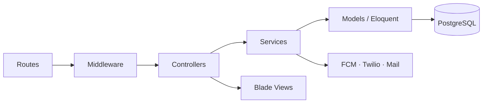

# 2. Arquitectura técnica

[← Índice](./README.md)

## 2.1 Stack tecnológico

| Capa | Tecnología | Versión / notas |
|------|------------|-----------------|
| Lenguaje | PHP | 8.1.33 (producción) |
| Framework | Laravel | 9.52.x |
| ORM | Eloquent | Incluido en Laravel |
| BD | PostgreSQL | `DB_CONNECTION=pgsql` |
| Servidor HTTP | Apache 2.4 | mod_php / DocumentRoot `public/` |
| Frontend admin | Blade + jQuery + DataTables | Assets en `public/` |
| Frontend kiosco | Blade + JS propio | `resources/views/frontend/` |
| Build | Vite 3 | Uso mínimo; mayoría assets estáticos |
| Permisos | spatie/laravel-permission | Roles + permisos granulares |
| Medios | spatie/laravel-media-library | Fotos visitantes, QR |
| API auth | tymon/jwt-auth | Guard `api` |
| Excel | phpoffice/phpspreadsheet | Imports masivos |
| QR | simplesoftwareio/simple-qrcode | Pases en `public/qrcode/` |
| Errores | sentry/sentry-laravel | Opcional vía DSN |
| SMS | laravel-notification-channels/twilio | Configurable |
| Config dinámica | akaunting/laravel-setting | Tabla `settings` |

## 2.2 Estructura de directorios

```
/var/www/html/
├── app/
│   ├── Console/Commands/       # Comandos Artisan personalizados
│   ├── Enums/                  # Status, VisitorStatus, UserRole, Gender
│   ├── Http/
│   │   ├── Controllers/
│   │   │   ├── Admin/          # Panel backend
│   │   │   ├── Api/v1/         # API REST
│   │   │   ├── Auth/
│   │   │   ├── CheckInController.php
│   │   │   └── CheckoutController.php
│   │   ├── Middleware/         # Auth, scope sede, destinos
│   │   ├── Services/           # VisitorService, PushNotification, JWT
│   │   ├── Composers/          # Menú lateral (BackendMenuComposer)
│   │   └── Requests/           # Form requests
│   ├── Models/                 # 19+ modelos Eloquent
│   ├── Notifications/          # Email/SMS
│   ├── Services/               # VisitDestinationService, InternalStaffImport
│   └── Support/                # PurposeNormalizer
├── config/                     # 32 archivos de configuración
├── database/
│   ├── migrations/             # 45 migraciones
│   └── seeders/                # Datos iniciales
├── docs/                       # Esta documentación
├── lang/es|en/                 # Traducciones
├── public/                     # Document root Apache
│   ├── index.php
│   ├── assets/
│   ├── frontend/
│   └── qrcode/                 # QR generados
├── resources/views/
│   ├── admin/                  # Vistas panel
│   └── frontend/               # Vistas kiosco
├── routes/
│   ├── web.php                 # Rutas web principales
│   ├── api.php                 # API v1
│   └── breadcrumbs.php
├── ssl-ca/                     # CA y certificados intranet
├── storage/                    # Logs, cache, sesiones, uploads temp
└── tests/                      # PHPUnit
```

## 2.3 Capas de la aplicación



### Responsabilidades

| Capa | Responsabilidad |
|------|-----------------|
| **Routes** | Definición de URLs y middleware por grupo |
| **Middleware** | Auth, permisos Spatie, scope por sede, feature access |
| **Controllers** | Orquestación HTTP, respuestas JSON/HTML |
| **Services** | Lógica de negocio reutilizable |
| **Models** | Persistencia, relaciones, accessors |
| **Views/JS** | Presentación, DataTables AJAX |

## 2.4 Archivos de configuración críticos

| Archivo | Propósito |
|---------|-----------|
| `config/app.php` | Nombre app, timezone, locale |
| `config/database.php` | Conexión PostgreSQL/MySQL |
| `config/auth.php` | Guards `web` (sesión) y `api` (JWT) |
| `config/jwt.php` | Token API móvil |
| `config/permission.php` | Spatie roles/permisos |
| `config/visit_destinations.php` | Flag `VISIT_DESTINATIONS_ENABLED` |
| `config/sentry.php` | Monitoreo de errores |
| `config/ssl.php` | Opciones SSL intranet |

## 2.5 Punto de entrada HTTP

Apache sirve **`/var/www/html/public/index.php`**, que bootstrapea Laravel y despacha rutas definidas en `routes/web.php` y `routes/api.php`.

## 2.6 Servicios de negocio clave

| Servicio | Archivo | Función |
|----------|---------|---------|
| VisitorService | `app/Http/Services/Visitor/VisitorService.php` | CRUD visitas, asignación destino |
| VisitDestinationService | `app/Services/VisitDestinationService.php` | Reglas, cola, notificaciones destino |
| EmployeeService | `app/Http/Services/Employee/EmployeeService.php` | Funcionarios y destinos asignados |
| PushNotificationService | `app/Http/Services/PushNotificationService.php` | FCM web y móvil |
| InternalStaffImportService | `app/Services/InternalStaffImportService.php` | Alta masiva funcionarios |

## 2.7 Patrones de diseño usados

- **Repository implícito** vía Eloquent (sin capa repository formal).
- **Service layer** para lógica compartida entre web y API.
- **Middleware pipeline** para autorización declarativa.
- **View composers** para menú dinámico según rol/permisos.
- **Feature flag** (`VISIT_DESTINATIONS_ENABLED`) solo para notificaciones push de destinos.

[← Introducción](./01-introduccion.md) · [Siguiente: Despliegue →](./03-despliegue.md)
