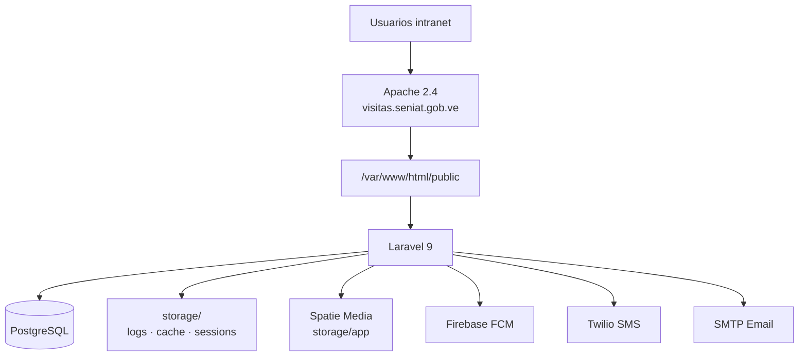

# 3. Despliegue e infraestructura

[← Índice](./README.md)

## 3.1 Entorno de producción actual

| Parámetro | Valor |
|-----------|-------|
| **Servidor** | Linux (hostname: `s02lpacvs02`) |
| **Ruta aplicación** | `/var/www/html` |
| **DocumentRoot** | `/var/www/html/public` |
| **VirtualHost** | `visitas.seniat.gob.ve` (puertos 80 y 443) |
| **Config Apache** | `/etc/apache2/sites-enabled/000-default.conf`, `default-ssl.conf` |
| **Usuario web** | `www-data` (Apache) |
| **PHP** | 8.1.33 |
| **Laravel** | 9.52.15 |
| **Base de datos** | PostgreSQL (`DB_CONNECTION=pgsql`) |

## 3.2 Diagrama de despliegue



## 3.3 Variables de entorno (`.env`)

El archivo activo está en **`/var/www/html/.env`**. Plantilla de referencia: `vps/.env.example`.

### Variables obligatorias

| Variable | Descripción |
|----------|-------------|
| `APP_NAME` | Nombre visible del sistema |
| `APP_ENV` | `production` en prod |
| `APP_KEY` | Clave de cifrado Laravel (`php artisan key:generate`) |
| `APP_DEBUG` | **`false` en producción** |
| `APP_URL` | URL base HTTPS del sistema |
| `APP_TIMEZONE` | Ej. `America/Caracas` |
| `DB_CONNECTION` | `pgsql` (actual) o `mysql` |
| `DB_HOST`, `DB_PORT`, `DB_DATABASE`, `DB_USERNAME`, `DB_PASSWORD` | Conexión BD |

### Variables operativas

| Variable | Default | Descripción |
|----------|---------|-------------|
| `CACHE_DRIVER` | `file` | Caché en `storage/framework/cache` |
| `SESSION_DRIVER` | `file` | Sesiones en `storage/framework/sessions` |
| `QUEUE_CONNECTION` | `sync` | Colas síncronas (sin worker obligatorio) |
| `LOG_CHANNEL` | `stack` | Logs en `storage/logs/laravel.log` |

### Integraciones

| Variable | Uso |
|----------|-----|
| `MAIL_*` | SMTP para correos |
| `TWILIO_*` | SMS |
| `FCM_SECRET_KEY`, `FCM_TOPIC` | Push Firebase |
| `SENTRY_LARAVEL_DSN` | Monitoreo errores (opcional) |
| `JWT_SECRET` | API móvil (`php artisan jwt:secret`) |
| `VISIT_DESTINATIONS_ENABLED` | Push a recepcionistas de destino (`true`/`false`) |

> **Importante:** Tras cambiar `.env`, ejecutar `php artisan config:clear`.

## 3.4 Permisos de archivos (crítico)

Apache (`www-data`) debe poder escribir en:

```bash
storage/
bootstrap/cache/
```

### Permisos recomendados

```bash
sudo chown -R www-data:www-data /var/www/html/storage /var/www/html/bootstrap/cache
sudo chmod -R ug+rwx /var/www/html/storage /var/www/html/bootstrap/cache
```

### Problema frecuente

Si ejecutas `php artisan tinker` o comandos como tu usuario personal (`ajvivas`), Laravel puede crear archivos de caché/sesión **propiedad de tu usuario**. Apache no podrá sobrescribirlos → error `Permission denied` en `storage/framework/cache`.

**Solución:** Corregir ownership o evitar tinker en producción con usuario distinto a `www-data`.

## 3.5 SSL / HTTPS

- Guía: [`SSL_IMPLEMENTATION_GUIDE.md`](../SSL_IMPLEMENTATION_GUIDE.md)
- Certificados CA: `ssl-ca/`
- Script automatizado: `setup-ssl-automatico.sh`
- Middleware `ForceSSL` existe pero está **comentado** en `app/Http/Kernel.php` (Apache ya termina SSL)

## 3.6 Symlink de storage

```bash
php artisan storage:link
```

Crea `public/storage` → `storage/app/public` para archivos públicos subidos.

## 3.7 Instalación inicial (resumen)

```bash
cd /var/www/html
composer install --no-dev --optimize-autoloader
cp vps/.env.example .env   # o copiar .env existente
php artisan key:generate
php artisan migrate --force
php artisan db:seed --force
php artisan storage:link
php artisan config:cache     # solo si APP_DEBUG=false y config estable
```

## 3.8 Cron y colas

| Tarea | Estado actual |
|-------|---------------|
| Scheduler | `app/Console/Kernel.php` — **sin tareas programadas** |
| Queue worker | No requerido (`QUEUE_CONNECTION=sync`) |

Si en el futuro se activan colas:

```bash
* * * * * cd /var/www/html && php artisan schedule:run >> /dev/null 2>&1
# Supervisor: php artisan queue:work
```

## 3.9 Logs y diagnóstico

| Recurso | Ubicación |
|---------|-----------|
| Log Laravel | `storage/logs/laravel.log` |
| Log Apache | `/var/log/apache2/error.log` |
| Modo debug | Solo con `APP_DEBUG=true` (nunca en prod prolongado) |

## 3.10 Backup recomendado

1. **Base de datos:** `pg_dump` diario de la BD PostgreSQL.
2. **Archivos:** `storage/app/` (medios), `.env` (seguro aparte).
3. **Código:** repositorio Git (no commitear `.env`).

[← Arquitectura](./02-arquitectura.md) · [Siguiente: Base de datos →](./04-base-de-datos.md)
