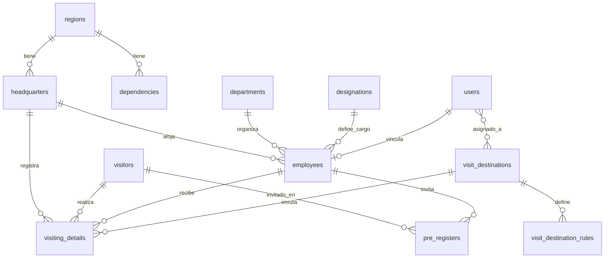

# 4. Base de datos

[← Índice](./README.md)

## 4.1 Motor y convenciones

- **Motor:** PostgreSQL en producción.
- **Migraciones:** Laravel en `database/migrations/` (45 archivos).
- **Timestamps:** Laravel estándar (`created_at`, `updated_at`).
- **Auditoría:** Trait `HasAuditColumn` (Shipu Watchable) en modelos clave.

## 4.2 Diagrama entidad-relación (simplificado)



## 4.3 Tablas principales

### Core de visitas

| Tabla | Modelo | Descripción |
|-------|--------|-------------|
| `visitors` | `Visitor` | Datos maestros del visitante (cédula, nombre, teléfono, foto) |
| `visiting_details` | `VisitingDetails` | **Cada visita**: entrada, salida, empleado, sede, estado, `reg_no`, `visit_destination_id` |
| `pre_registers` | `PreRegister` | Invitaciones previas |

### Organización

| Tabla | Modelo | Descripción |
|-------|--------|-------------|
| `regions` | `Region` | Regiones SENIAT |
| `headquarters` | `Headquarters` | Sedes (ej. Mata de Coco) |
| `dependencies` | `Dependency` | Dependencias regionales |
| `departments` | `Department` | Gerencias/unidades |
| `designations` | `Designation` | Cargos |
| `employees` | `Employee` | Funcionarios anfitriones |

### Destinos de visita (2026)

| Tabla | Modelo | Descripción |
|-------|--------|-------------|
| `visit_destinations` | `VisitDestination` | Destinos operativos (nombre, sede, orden) |
| `visit_destination_rules` | `VisitDestinationRule` | Reglas: `employee_id`, `department_id`, `designation_id` |
| `user_visit_destinations` | pivot | Recepcionistas asignadas a cada destino |

### Seguridad y sistema

| Tabla | Descripción |
|-------|-------------|
| `users` | Usuarios del panel |
| `roles`, `permissions`, pivots | Spatie RBAC |
| `backend_menus` | Menú lateral dinámico |
| `settings` | Configuración en BD (akaunting) |
| `media` | Spatie Media Library |
| `languages` | Idiomas disponibles |
| `attendances` | Asistencia empleados |
| `jobs`, `notifications` | Infraestructura Laravel |

## 4.4 Tabla `visiting_details` (campos clave)

| Campo | Tipo | Descripción |
|-------|------|-------------|
| `visitor_id` | FK | Visitante |
| `employee_id` | FK | Funcionario destino |
| `region_id`, `headquarters_id` | FK | Ubicación |
| `visit_destination_id` | FK nullable | Destino operativo (cola secundaria) |
| `purpose` | text | Motivo de la visita |
| `reg_no` | string | Número correlativo del día |
| `checkin_at` | datetime | Hora de entrada |
| `checkout_at` | datetime nullable | Hora de salida |
| `status` | int | 1=Pendiente, 2=Aceptado, 3=Rechazado |
| `created_at` | timestamp | Fecha de registro (filtro "Solo hoy" en cola) |

## 4.5 Seeders

Orden en `DatabaseSeeder`:

1. Settings → Roles → Menú → Permisos → RolePermissions
2. User (admin por defecto) → UserPermissions
3. Departments → Designations → Languages
4. Supervisor role → Regions → Dependencies

### Seeders opcionales (no en DatabaseSeeder)

| Seeder | Uso |
|--------|-----|
| `VisitDestinationSeeder` | Destino Atención Contribuyente Mata de Coco |
| `EmployeeTableSeeder` | Empleados de prueba |
| `TestVisitorSeeder` | Visitas de prueba |

```bash
php artisan db:seed --class=VisitDestinationSeeder
```

### Credenciales seed por defecto

> ⚠️ Cambiar inmediatamente en producción: `admin@example.com` / `123456`

## 4.6 Migraciones recientes relevantes

| Migración | Cambio |
|-----------|--------|
| `2026_06_23_100000_create_visit_destinations_tables` | Tablas destinos + columna `visit_destination_id` |
| `2026_06_23_110000_add_visit_destinations_permissions_and_menu` | Permisos y menú |
| `2026_06_23_120000_rename_visit_destination_permissions` | Nombres con guiones |
| `2026_06_23_110001_grant_visit_destination_queue_to_reception` | Cola para rol Reception |

### Aplicar migraciones en producción

```bash
php artisan migrate --force
```

**Nunca** ejecutar `migrate:fresh` ni `migrate:rollback` en producción sin backup.

[← Despliegue](./03-despliegue.md) · [Siguiente: Módulos →](./05-modulos-funcionales.md)
