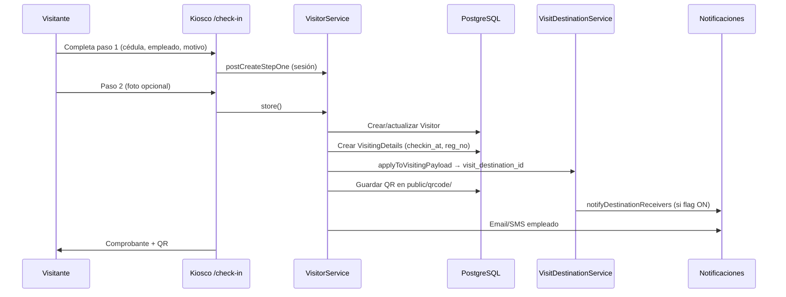
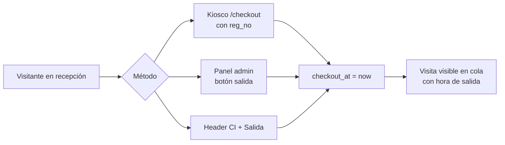

# 6. Flujos de trabajo

[← Índice](./README.md)

## 6.1 Registro de visitante (check-in)

### Detalle técnico

1. **`CheckInController@postCreateStepOne`** — valida y guarda en sesión.
2. **`CheckInController@store`** — delega a `VisitorService`.
3. Se genera **`reg_no`** correlativo diario por sede.
4. **`VisitDestinationService::resolveDestinationId`** evalúa reglas activas (employee → designation → department).
5. Se asigna **`visit_destination_id`** automáticamente (independiente del flag de notificaciones).
6. Estado inicial típico: **Aceptado (2)** tras registro en kiosco.

### Variantes de check-in

| Flujo | Ruta | Caso |
|-------|------|------|
| Nuevo visitante | `/check-in/create-step-one` | Primera visita |
| Recurrente | `/check-in/return` | Busca por cédula |
| Pre-registrado | `/check-in/pre-registered` | Invitación previa |
| QR escaneo | `/scanqr` | Lectura móvil |

## 6.2 Salida de visitante (checkout)

| Método | Controlador | Campo actualizado |
|--------|-------------|-------------------|
| Kiosco | `CheckoutController@update` | `checkout_at` |
| Admin visitantes | `VisitorController@checkout` | `checkout_at` |
| Búsqueda CI header | `VisitorController@search` | `checkout_at` |

## 6.3 Cola por destino (recepción secundaria)

**URL:** `/admin/visit-destination-queue`

### Requisitos de acceso

1. Usuario con rol **Reception**, **supervisor** o **Admin**.
2. Al menos un destino asignado en pivot `user_visit_destinations`.
3. Permiso `visit-destination-queue`.

### Flujo al abrir la cola

1. `VisitDestinationQueueController@index` obtiene destinos del usuario.
2. **`repairMissingDestinations(today())`** — asigna `visit_destination_id` a visitas de hoy sin destino.
3. Cuenta **registrados hoy** y **en instalaciones** (sin `checkout_at`).
4. DataTables AJAX en `get-visits` con filtros:
   - **Solo hoy** (default): `whereDate(created_at, today())`
   - **Solo sin salida**: `whereNull(checkout_at)`

### Criterio de inclusión en cola

Una visita aparece si:

- `visit_destination_id` está en los destinos del usuario, **o**
- `visit_destination_id` es NULL pero `employee_id` coincide con regla del destino (fallback).

### Ejemplo: Atención al Contribuyente

| Elemento | Valor |
|----------|-------|
| Destino | `Atencion Contribuyente - Piso 4` |
| Slug | `atencion-contribuyente-mata-coco` |
| Sede | Mata de Coco (`headquarters_id=1`) |
| Regla | `employee_id = 99` |
| Empleado ficticio | ATENCION CONTRIBUYENTE |

## 6.4 Pre-registro → visita

1. Empleado crea pre-registro en admin.
2. Visitante llega → `/check-in/pre-registered`.
3. Sistema valida invitación y crea `visiting_details`.

## 6.5 Cambio de estado de visita

| Estado | Cuándo |
|--------|--------|
| Pendiente | Requiere aprobación empleado (email con token) |
| Aceptado | Aprobado o registro directo kiosco |
| Rechazado | Empleado rechaza |

Ruta pública empleado: `visitor/change-status/{status}/{token}`

## 6.6 Registro manual desde admin

`VisitorController@store` / `update` → `VisitorService` con misma lógica de destino que check-in.

## 6.7 Asistencia de empleados

- Clock-in/out desde admin o API
- Tabla `attendances` vinculada a empleados

## 6.8 Carga masiva de funcionarios

1. Descargar plantilla Excel.
2. Completar datos (cédula, cargo, departamento, sede).
3. Subir en `/admin/internal-staff-data`.
4. `InternalStaffImportService` crea/actualiza `User` + `Employee`.

[← Módulos](./05-modulos-funcionales.md) · [Siguiente: Seguridad →](./07-seguridad-permisos.md)
