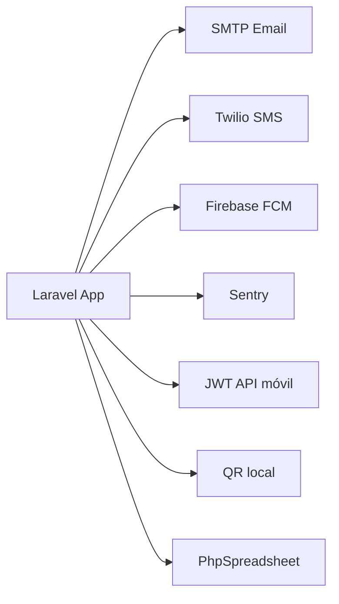

# 9. Integraciones externas

[← Índice](./README.md)

## 9.1 Mapa de integraciones



## 9.2 Email (SMTP)

| Aspecto | Detalle |
|---------|---------|
| Config | `MAIL_*` en `.env` + `/admin/setting/email` |
| Uso | Confirmaciones visita, invitaciones, reportes |
| Clases | `app/Notifications/` |

Plantillas editables en admin → Setting → Email Template.

## 9.3 SMS (Twilio)

| Variable | Descripción |
|----------|-------------|
| `TWILIO_ACCOUNT_SID` | Cuenta Twilio |
| `TWILIO_AUTH_TOKEN` | Token |
| `TWILIO_FROM` | Número origen |

Config adicional: `config/twilio-notification-channel.php`, admin → Setting → SMS.

## 9.4 Push notifications (FCM)

### Móvil (API)

- Endpoints: `POST /api/v1/fcm-subscribe`, `fcm-unsubscribe`
- Controlador: `Api/v1/PushNotificationController`

### Web (panel admin)

- Token guardado en `users.web_token`
- Endpoint: `POST /admin/store-token`
- Servicio: `PushNotificationService`

| Variable | Uso |
|----------|-----|
| `FCM_SECRET_KEY` | Server key Firebase |
| `FCM_TOPIC` | Topic opcional |

### Notificaciones de cola por destino

- Método: `VisitDestinationService::notifyDestinationReceivers`
- Requiere: `VISIT_DESTINATIONS_ENABLED=true` + usuarios con `web_token`
- Título: "Visitante en camino"

## 9.5 API JWT (app móvil)

| Endpoint | Descripción |
|----------|-------------|
| `POST /api/v1/login` | Obtener token |
| `GET /api/v1/me` | Perfil |
| `GET /api/v1/refresh-token` | Renovar token |

Generar secreto: `php artisan jwt:secret`

## 9.6 Sentry (monitoreo)

- Paquete: `sentry/sentry-laravel`
- Config: `config/sentry.php`
- Variable: `SENTRY_LARAVEL_DSN`
- Frontend: `@sentry/browser` en vistas kiosco

## 9.7 Códigos QR

- Paquete: `simplesoftwareio/simple-qrcode`
- Salida: `public/qrcode/{reg_no}.png` (aprox.)
- Ruta consulta: `/qrcode/{number}`

## 9.8 Imports Excel

- Paquete: `phpoffice/phpspreadsheet`
- Usos: CDI masivo, Plaza Venezuela, plantillas admin

## 9.9 WhatsApp

Configurable vía admin → Setting → WhatsApp (mensajes opcionales).

## 9.10 Metabase / BI externo

**No hay integración nativa** en el código. Para reportes externos:

- Conectar Metabase directamente a PostgreSQL
- **Base recomendada:** tabla `visiting_details` (no `visitors.updated_at`)
- Filtrar por `created_at` o `checkin_at` para visitas del día
- Join: `visiting_details` → `visitors`, `employees`, `headquarters`

### Consulta ejemplo (visitas del día)

```sql
SELECT
    vd.id,
    v.national_identification_no AS cedula,
    CONCAT(v.first_name, ' ', v.last_name) AS nombre,
    e.name AS empleado,
    h.name AS sede,
    vd.purpose AS motivo,
    vd.checkin_at AS entrada,
    vd.checkout_at AS salida,
    vd.status
FROM visiting_details vd
JOIN visitors v ON v.id = vd.visitor_id
LEFT JOIN employees e ON e.id = vd.employee_id
LEFT JOIN headquarters h ON h.id = vd.headquarters_id
WHERE vd.created_at::date = CURRENT_DATE
ORDER BY vd.created_at DESC;
```

[← Comandos](./08-comandos-mantenimiento.md) · [Siguiente: Producción segura →](./10-produccion-segura.md)
