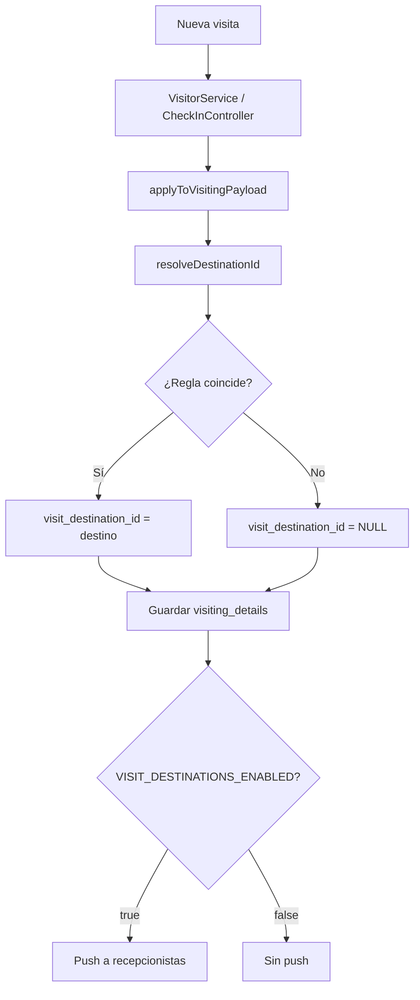

# 11. Destinos de visita y cola por destino

[← Índice](./README.md)

Módulo para **recepción secundaria**: enrutar visitas a áreas operativas (pisos, módulos) y mostrar cola en tiempo real a recepcionistas asignadas.

## 11.1 Conceptos

| Concepto | Descripción |
|----------|-------------|
| **Destino** | Área lógica (`visit_destinations`) con nombre, sede y orden |
| **Regla** | Condición que asigna visitas al destino (`visit_destination_rules`) |
| **Recepcionista** | Usuario con destino(s) en `user_visit_destinations` |
| **Cola** | Vista `/admin/visit-destination-queue` filtrada por destinos del usuario |

## 11.2 Tipos de regla

| Tipo | Campo `rule_type` | Ejemplo |
|------|-------------------|---------|
| Empleado | `employee_id` | `99` → ATENCION CONTRIBUYENTE |
| Departamento | `department_id` | Gerencia X |
| Cargo | `designation_id` | Cargo Y |

Prioridad de resolución en `VisitDestinationService::resolveDestinationId`:

1. employee_id
2. designation_id
3. department_id

Si el destino tiene `headquarters_id`, la visita debe coincidir en sede.

## 11.3 Configuración: Atención al Contribuyente (Mata de Coco)

Seeder: `database/seeders/VisitDestinationSeeder.php`

| Campo | Valor |
|-------|-------|
| Nombre | Atencion Contribuyente - Piso 4 |
| Slug | `atencion-contribuyente-mata-coco` |
| Sede | `headquarters_id = 1` |
| Regla | `employee_id = 99` |

Ejecutar una vez:

```bash
php artisan db:seed --class=VisitDestinationSeeder
```

## 11.4 Asignar recepcionistas

### Desde admin (recomendado)

1. **Destinos de visita** → Editar destino → seleccionar usuarios Reception
2. O **Empleados** → Editar recepcionista → campo "Destinos de visita"

### Desde CLI

```bash
php artisan visit-destinations:assign-user email@seniat.gob.ve atencion-contribuyente-mata-coco
```

## 11.5 Flujo técnico de asignación



## 11.6 Cola: lógica de filtrado

Archivo: `VisitDestinationQueueController.php`

1. Obtener destinos del usuario autenticado.
2. `repairMissingDestinations(today())` — corrige visitas de hoy sin destino.
3. `applyDestinationFilter($query, $destinationIds)`:
   - Incluye `visit_destination_id IN (...)`
   - **Fallback:** `visit_destination_id IS NULL AND employee_id IN (reglas employee del destino)`

### Filtros UI

| Checkbox | Efecto |
|----------|--------|
| Solo hoy | `whereDate(created_at, today())` |
| Solo sin salida | `whereNull('checkout_at')` |

### Tarjetas resumen

- **Registrados hoy:** visitas del día para sus destinos
- **En instalaciones:** sin `checkout_at` y estado Pendiente/Aceptado

## 11.7 Archivos del módulo

| Archivo | Rol |
|---------|-----|
| `app/Services/VisitDestinationService.php` | Lógica central |
| `app/Http/Controllers/Admin/VisitDestinationController.php` | CRUD destinos y reglas |
| `app/Http/Controllers/Admin/VisitDestinationQueueController.php` | Cola |
| `app/Http/Middleware/EnsureVisitDestinationAccess.php` | Autorización |
| `app/Models/VisitDestination.php` | Modelo destino |
| `app/Models/VisitDestinationRule.php` | Modelo regla |
| `resources/views/admin/visit-destination/` | Vistas CRUD |
| `resources/views/admin/visit-destination-queue/` | Vista cola |
| `config/visit_destinations.php` | Feature flag notificaciones |

## 11.8 Permisos requeridos

| Acción | Permiso / Rol |
|--------|---------------|
| Ver cola | `visit-destination-queue` + destinos asignados |
| CRUD destinos | `visit-destinations_*` + Admin/supervisor |
| Eliminar destino | Solo Admin + sin visitas vinculadas |

## 11.9 Problemas conocidos y soluciones

| Síntoma | Causa | Solución |
|---------|-------|----------|
| Cola vacía con visitas visibles en panel general | `visit_destination_id` NULL | Auto-reparación en cola; backfill; verificar reglas |
| Status `statuses.2` | Traducción incorrecta | Corregido → `visitor_statuses` |
| Error cache Permission denied | Tinker como otro usuario | Permisos www-data; caché reglas ya no usa disco |
| Sin push en destino | Flag OFF o sin web_token | `VISIT_DESTINATIONS_ENABLED=true`; usuario debe abrir panel |

## 11.10 Escalar a nuevos destinos

1. Crear empleado ficticio o usar departamento/cargo existente.
2. Admin → Destinos de visita → Nuevo.
3. Agregar regla(s).
4. Asignar recepcionistas.
5. Backfill opcional para histórico:

```bash
php artisan visit-destinations:backfill --dry-run --only-null --headquarters={id}
php artisan visit-destinations:backfill --only-null --headquarters={id}
```

6. Validar en cola con visita de prueba.

---

[← Producción segura](./10-produccion-segura.md) · [↑ Volver al índice](./README.md)
