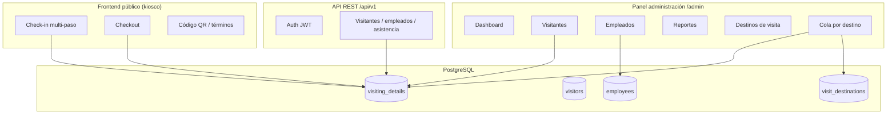

# Sistema de Gestión de Visitas — SENIAT

> Documentación técnica, funcional y operativa del sistema desplegado en intranet.

|                   |                                                     |
| ----------------- | --------------------------------------------------- |
| **Proyecto**      | `dpas2/seniat` v1.3.0                               |
| **Framework**     | Laravel 9.52 · PHP 8.1                              |
| **Base de datos** | PostgreSQL (producción actual)                      |
| **Servidor web**  | Apache 2.4 · DocumentRoot `/var/www/html/public`    |
| **Dominio**       | `visitas.seniat.gob.ve` (HTTP/HTTPS)                |
| **Zona horaria**  | `America/Caracas` (configurable vía `APP_TIMEZONE`) |

---

## Índice de documentación

| #   | Documento                                                   | Contenido                                   |
| --- | ----------------------------------------------------------- | ------------------------------------------- |
| 1   | [Introducción](./01-introduccion.md)                        | Propósito, usuarios, alcance funcional      |
| 2   | [Arquitectura](./02-arquitectura.md)                        | Stack, capas, directorios, dependencias     |
| 3   | [Despliegue e infraestructura](./03-despliegue.md)          | Servidor, Apache, SSL, `.env`, permisos     |
| 4   | [Base de datos](./04-base-de-datos.md)                      | Tablas, relaciones, migraciones, seeders    |
| 5   | [Módulos funcionales](./05-modulos-funcionales.md)          | Panel admin, kiosco, API, reportes          |
| 6   | [Flujos de trabajo](./06-flujos-trabajo.md)                 | Check-in, checkout, cola, pre-registro      |
| 7   | [Seguridad y permisos](./07-seguridad-permisos.md)          | Roles, Spatie, middleware, accesos          |
| 8   | [Comandos y mantenimiento](./08-comandos-mantenimiento.md)  | Artisan, imports, backfill, troubleshooting |
| 9   | [Integraciones](./09-integraciones.md)                      | FCM, Twilio, email, Sentry, JWT             |
| 10  | [Operación segura en producción](./10-produccion-segura.md) | Qué hacer y qué **no** hacer                |
| 11  | [Destinos de visita y cola](./11-destinos-visita.md)        | Módulo de recepción secundaria              |

---

## Vista rápida del sistema

---

## Roles del sistema

| Rol            | Uso principal                                   |
| -------------- | ----------------------------------------------- |
| **Admin**      | Configuración total, usuarios, destinos, sedes  |
| **supervisor** | Gestión acotada a su sede (`headquarters_id`)   |
| **Reception**  | Recepción principal, cola de destinos asignados |
| **Employee**   | Anfitrión; consulta sus visitas vía app/API     |

---

## URLs principales

| URL                              | Descripción                                 |
| -------------------------------- | ------------------------------------------- |
| `/` o `/check-in`                | Kiosco de registro de visitantes            |
| `/checkout`                      | Salida de visitantes                        |
| `/admin/dashboard`               | Panel administrativo                        |
| `/admin/visit-destination-queue` | Cola por destino (recepcionistas asignadas) |
| `/admin/internal-staff-data`     | Carga de funcionarios (intranet, sin login) |
| `/cdi`                           | Alias corto → carga de funcionarios         |
| `/api/v1/`*                      | API móvil con JWT                           |

---

## Documentación relacionada en el repositorio

| Archivo                                                          | Descripción                                            |
| ---------------------------------------------------------------- | ------------------------------------------------------ |
| `[/README.md](../README.md)`                                     | Guía extensa de instalación y migración (2600+ líneas) |
| `[/SSL_IMPLEMENTATION_GUIDE.md](../SSL_IMPLEMENTATION_GUIDE.md)` | Certificados SSL intranet                              |
| `[/vps/.env.example](../vps/.env.example)`                       | Plantilla de variables de entorno                      |

---

## Canvas interactivo

Abre el canvas **「Documentación SENIAT」** para una vista navegable con resumen visual de arquitectura, módulos y guías operativas.

---

*Última actualización: julio 2026 · Generado a partir del código en `/var/www/html`*